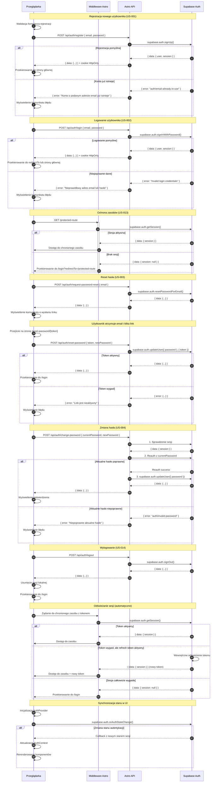

```mermaid
sequenceDiagram
    autonumber

    participant Browser as Przeglądarka
    participant Middleware as Middleware Astro
    participant API as Astro API
    participant Supabase as Supabase Auth

    %% Scenariusz 1: Rejestracja użytkownika (US-001)
    Note over Browser,Supabase: Rejestracja nowego użytkownika (US-001)
    Browser->>Browser: Walidacja formularza rejestracji
    Browser->>API: POST /api/auth/register { email, password }
    API->>Supabase: supabase.auth.signUp()

    alt Rejestracja pomyślna
        Supabase-->>API: { data: { user, session } }
        API-->>Browser: { data: {...} } + cookie HttpOnly
        Browser->>Browser: Przekierowanie do strony głównej
    else Konto już istnieje
        Supabase-->>API: { error: "auth/email-already-in-use" }
        API-->>Browser: { error: "Konto o podanym adresie email już istnieje" }
        Browser->>Browser: Wyświetlenie komunikatu błędu
    end

    %% Scenariusz 2: Logowanie użytkownika (US-002)
    Note over Browser,Supabase: Logowanie użytkownika (US-002)
    Browser->>API: POST /api/auth/login { email, password }
    API->>Supabase: supabase.auth.signInWithPassword()

    alt Logowanie pomyślne
        Supabase-->>API: { data: { user, session } }
        API-->>Browser: { data: {...} } + cookie HttpOnly
        Browser->>Browser: Przekierowanie do redirectTo lub strony głównej
    else Niepoprawne dane
        Supabase-->>API: { error: "Invalid login credentials" }
        API-->>Browser: { error: "Nieprawidłowy adres email lub hasło" }
        Browser->>Browser: Wyświetlenie komunikatu błędu
    end

    %% Scenariusz 3: Ochrona zasobów (US-013)
    Note over Browser,Supabase: Ochrona zasobów (US-013)
    Browser->>Middleware: GET /protected-route
    activate Middleware

    Middleware->>Supabase: supabase.auth.getSession()

    alt Sesja aktywna
        Supabase-->>Middleware: { data: { session } }
        Middleware->>Browser: Dostęp do chronionego zasobu
    else Brak sesji
        Supabase-->>Middleware: { data: { session: null } }
        Middleware-->>Browser: Przekierowanie do /login?redirectTo=/protected-route
    end
    deactivate Middleware

    %% Scenariusz 4: Reset hasła (US-003)
    Note over Browser,Supabase: Reset hasła (US-003)
    Browser->>API: POST /api/auth/request-password-reset { email }
    API->>Supabase: supabase.auth.resetPasswordForEmail()
    Supabase-->>API: { data: {...} }
    API-->>Browser: { data: {...} }
    Browser->>Browser: Wyświetlenie komunikatu o wysłaniu linku

    Note over Browser,Supabase: Użytkownik otrzymuje email i klika link
    Browser->>Browser: Przejście na stronę /reset-password/[token]
    Browser->>API: POST /api/auth/reset-password { token, newPassword }
    API->>Supabase: supabase.auth.updateUser({ password }, { token })

    alt Token aktywny
        Supabase-->>API: { data: {...} }
        API-->>Browser: { data: {...} }
        Browser->>Browser: Przekierowanie do /login
    else Token wygasł
        Supabase-->>API: { error: {...} }
        API-->>Browser: { error: "Link jest nieaktywny" }
        Browser->>Browser: Wyświetlenie błędu
    end

    %% Scenariusz 5: Zmiana hasła (US-004)
    Note over Browser,Supabase: Zmiana hasła (US-004)
    Browser->>API: POST /api/auth/change-password { currentPassword, newPassword }
    API->>Supabase: 1. Sprawdzenie sesji
    Supabase-->>API: { data: { session } }
    API->>Supabase: 2. Reauth z currentPassword

    alt Aktualne hasło poprawne
        Supabase-->>API: Reauth success
        API->>Supabase: 3. supabase.auth.updateUser({ password })
        Supabase-->>API: { data: {...} }
        API-->>Browser: { data: {...} }
        Browser->>Browser: Wyświetlenie potwierdzenia
    else Aktualne hasło niepoprawne
        Supabase-->>API: { error: "auth/invalid-password" }
        API-->>Browser: { error: "Niepoprawne aktualne hasło" }
        Browser->>Browser: Wyświetlenie błędu
    end

    %% Scenariusz 6: Wylogowanie (US-014)
    Note over Browser,Supabase: Wylogowanie (US-014)
    Browser->>API: POST /api/auth/logout
    API->>Supabase: supabase.auth.signOut()
    Supabase-->>API: { data: {...} }
    API-->>Browser: { data: {...} }
    Browser->>Browser: Usunięcie sesji lokalnej
    Browser->>Browser: Przekierowanie do /login

    %% Scenariusz 7: Odświeżanie sesji
    Note over Browser,Supabase: Odświeżanie sesji (automatyczne)
    Browser->>Middleware: Żądanie do chronionego zasobu z tokenem
    Middleware->>Supabase: supabase.auth.getSession()

    alt Token aktywny
        Supabase-->>Middleware: { data: { session } }
        Middleware->>Browser: Dostęp do zasobu
    else Token wygasł, ale refresh token aktywny
        Supabase->>Supabase: Wewnętrzne odświeżenie tokenu
        Supabase-->>Middleware: { data: { session } } (nowy token)
        Middleware->>Browser: Dostęp do zasobu + nowy token
    else Sesja całkowicie wygasła
        Supabase-->>Middleware: { data: { session: null } }
        Middleware-->>Browser: Przekierowanie do /login
    end

    %% Scenariusz 8: Automatyczna synchronizacja stanu w UI
    Note over Browser,Supabase: Synchronizacja stanu w UI
    Browser->>Browser: Inicjalizacja AuthProvider
    Browser->>Supabase: supabase.auth.onAuthStateChange()

    alt Zmiana stanu autentykacji
        Supabase-->>Browser: Callback z nowym stanem sesji
        Browser->>Browser: Aktualizacja AuthContext
        Browser->>Browser: Rerenderowanie komponentów
    end
```
