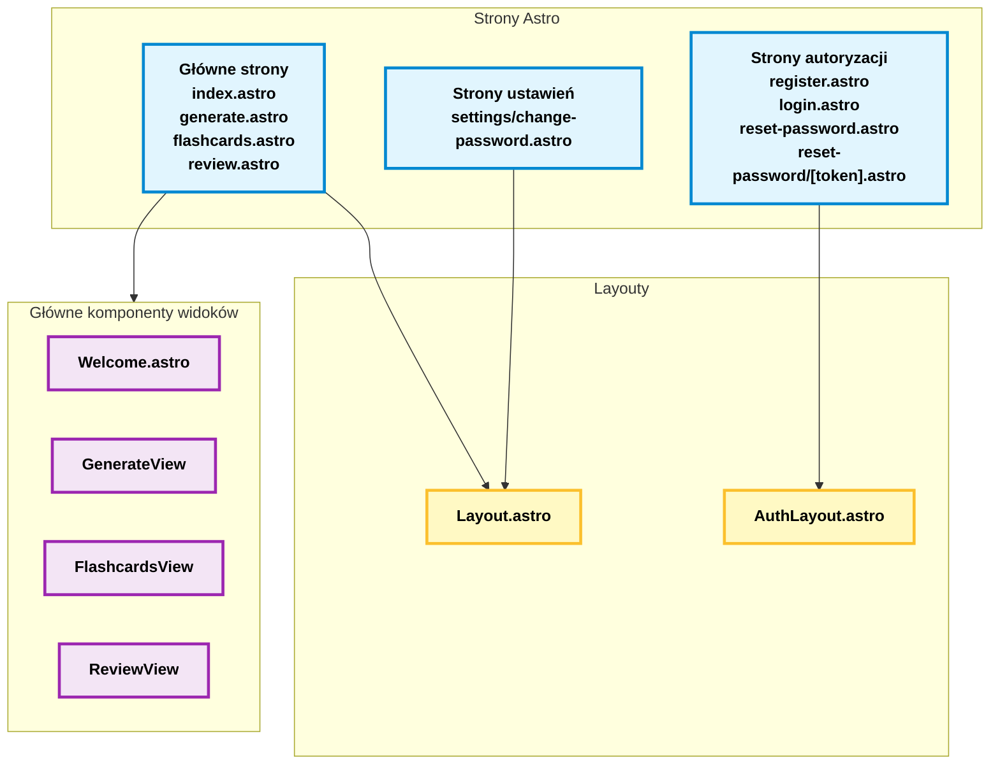
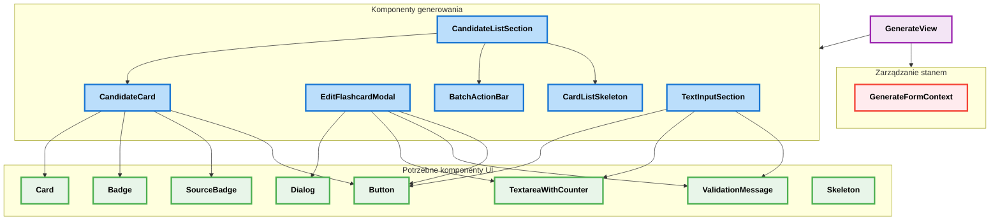
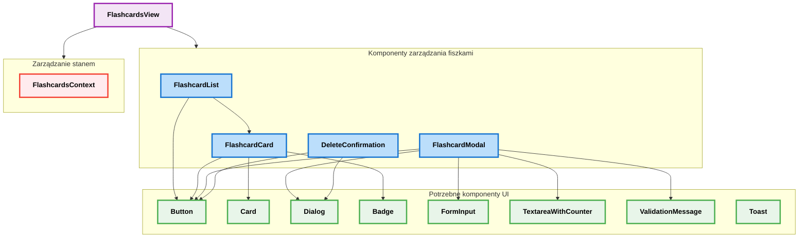
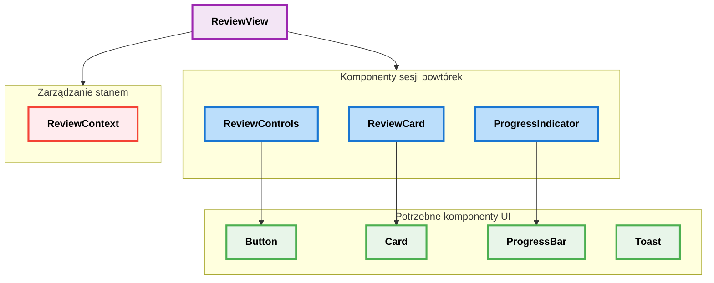
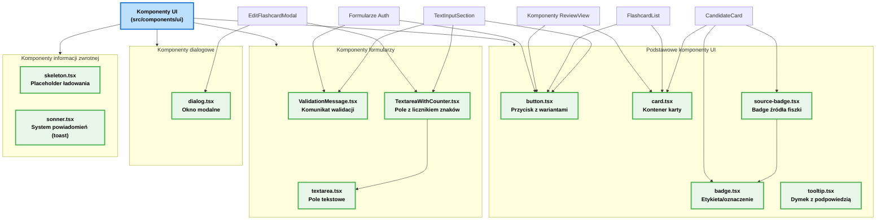

# Architektura UI Repetix

## 1. Struktura stron i layoutów

## 2. Komponenty generowania fiszek

## 3. Komponenty zarządzania fiszkami

## 4. Komponenty sesji powtórek

## 5. Komponenty autoryzacji

```mermaid
flowchart TD
    %% Definicja stylów
    classDef pageClass fill:#e1f5fe,stroke:#0288d1,stroke-width:3px,color:#000,font-size:16px,font-weight:bold
    classDef formClass fill:#bbdefb,stroke:#1976d2,stroke-width:3px,color:#000,font-size:16px,font-weight:bold
    classDef stateClass fill:#ffebee,stroke:#f44336,stroke-width:3px,color:#000,font-size:16px,font-weight:bold
    classDef uiClass fill:#e8f5e9,stroke:#4caf50,stroke-width:3px,color:#000,font-size:16px,font-weight:bold

    %% Strony
    Register["register.astro"]:::pageClass
    Login["login.astro"]:::pageClass
    ResetPwd["reset-password.astro"]:::pageClass
    ResetToken["reset-password/[token].astro"]:::pageClass
    Settings["settings/change-password.astro"]:::pageClass

    %% Komponenty
    subgraph AuthComponents["Komponenty autoryzacji"]
        LoginForm["LoginForm"]:::formClass
        RegistrationForm["RegistrationForm"]:::formClass
        RequestResetForm["RequestResetForm"]:::formClass
        NewPasswordForm["NewPasswordForm"]:::formClass
        ChangePasswordForm["ChangePasswordForm"]:::formClass
        PasswordStrengthMeter["PasswordStrengthMeter"]:::formClass
    end

    subgraph UIComponents["Potrzebne komponenty UI"]
        FormInput["FormInput"]:::uiClass
        Button["Button"]:::uiClass
        ValidationMessage["ValidationMessage"]:::uiClass
        Toast["Toast"]:::uiClass
    end

    subgraph State["Zarządzanie stanem"]
        AuthContext["AuthContext"]:::stateClass
    end

    %% Relacje
    Register --> RegistrationForm
    Login --> LoginForm
    ResetPwd --> RequestResetForm
    ResetToken --> NewPasswordForm
    Settings --> ChangePasswordForm

    AuthComponents --> State

    RegistrationForm --> PasswordStrengthMeter
    NewPasswordForm --> PasswordStrengthMeter
    ChangePasswordForm --> PasswordStrengthMeter

    RegistrationForm --> FormInput
    RegistrationForm --> Button
    RegistrationForm --> ValidationMessage

    LoginForm --> FormInput
    LoginForm --> Button
    LoginForm --> ValidationMessage

    RequestResetForm --> FormInput
    RequestResetForm --> Button
    RequestResetForm --> Toast

    NewPasswordForm --> FormInput
    NewPasswordForm --> Button
    NewPasswordForm --> ValidationMessage
    NewPasswordForm --> Toast

    ChangePasswordForm --> FormInput
    ChangePasswordForm --> Button
    ChangePasswordForm --> ValidationMessage
    ChangePasswordForm --> Toast
```

## 6. Współdzielone komponenty UI

